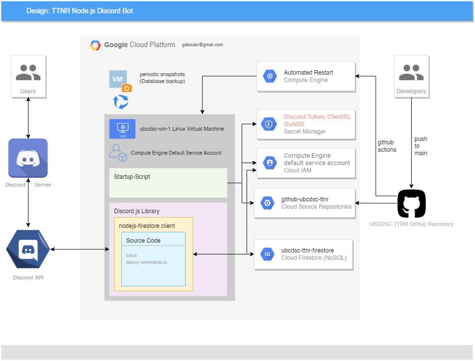
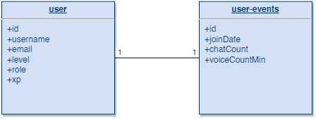

# Design

**High-level architecture**

**Software Design**

The bot's main entry point is in bot.js where the bot can receive slash commands and events.
There is also another entry point where new commands can be deployed to discord in deploy-commands.js.

The design pattern is separated into :

1. bot.js - the program (initialization and command/event handler)
2. /commands, /events - the modules (handle commands, events)

Follow Discord.js documentation guides for implementing commands, event handling, and storing/fetching data with Sequelize and SQLite3.
[https://discordjs.guide/sequelize/#alpha-connection-information](https://discordjs.guide/sequelize/#alpha-connection-information)

Firestore Design

Collections:

- users
- messages

Documents: 

- user
    - id: string
    - username: string
    - email: string
    - level: number
    - role: string
    - xp: number
- user-events
    - id: string
    - joinDate: date
    - chatCount: number
    - voiceCountMin: number

Database functions

[https://cloud.google.com/nodejs/docs/reference/firestore/latest](https://cloud.google.com/nodejs/docs/reference/firestore/latest)
